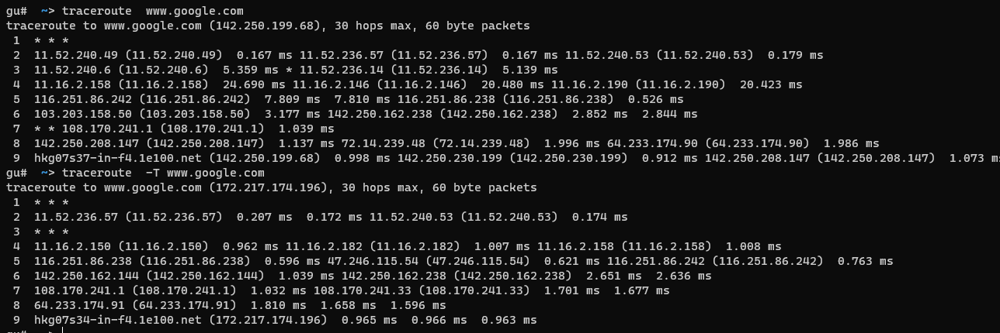
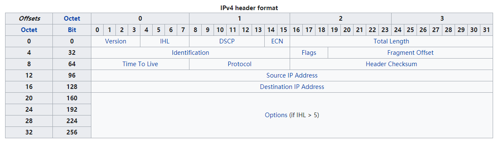
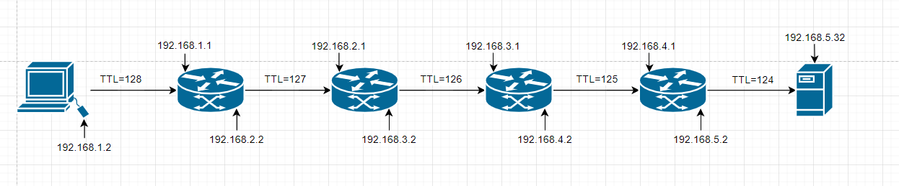
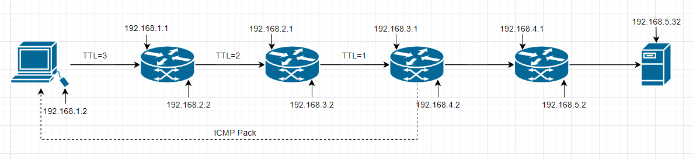
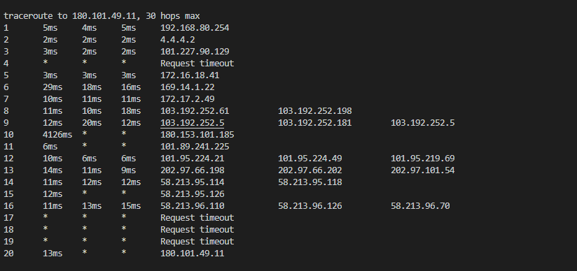

# tcprt

## 介绍
----

产品发布后有玩家反映客户端（Windows系统）无法连接服务器， 使用`ping.exe`、`tracert.exe`工具检查均未发现有异常情况，但是`telnet`却无法连接。最后发现发现国内某些运营商网络在对`icmp`和`tcp`协议的路由选择上不一致导致。最后运维人员希望能够收集出错时的路由信息。
我们知道在Linux系统上实现很简单系统自带的`traceroute`工具自带tcp协议的探测，实现起来比较简单。但是客户端产品大多是Windows系统的，自带的`tracert.exe`只有icmp探测类型。下图是分别使用`ICMP`和`TCP`tracerouter的对比，图中可以看到明显的不同路由路径。


## 目标
----

1. 实现类似于linux的`traceroute -T`方法

## 原理与实现
---

### tracerouter原理
---

为了理解tracerouter原理，我们先来看下IP的协议头：

这里面有个8比特的Time To Live (TTL)字段，它代表是报文的存活时间，这个8位字段避免报文在互联网中永远存在（例如陷入路由环路）。存活时间以秒为单位，但小于一秒的时间均向上取整到一秒。在现实中，这实际上成了一个跳数计数器：报文经过的每个路由器都将此字段减1，当此字段等于0时，报文不再向下一跳传送并被丢弃，最大值是255。常规地，一份ICMP报文被发回报文发送端说明其发送的报文已被丢弃。这也是traceroute的核心原理。
什么意思呢？我们看下下面的图：

这里表示的是192.168.1.2这台客户机访问192.168.5.32的路由图，报文首先在客户机（1.2）这台机器被创建出来并设置TTL字段为128, 然后经过若干路由接力传递最终到达目标服务器，在接力过程中没遇到一个路由中转，路由器均会将TTL值减一。再看这张图：

这次我们在客户机组装报文时将TTL设置的比较小只有3，这样在报文到达第一个路由路时路由检查报文中TTL的值发现TTL大于1于是修改报文将TTL减1继续转发给下一个路由，第二个路由采用同样的方法修改TTL后继续发给第三个路由，第三个路由受到报文时同样检查TTL值，发现TTL值已经为1，意识到自己已经是最后一跳不能再继续转发了，所以直接向源主机发送类型为11的ICMP报文告诉源主机报文发送失败（当然返回的报文也需要若干路由跳转，图中返回的虚箭头指示表达报文最终到达源主机）。

traceroute为了探测每个路由的地址，循环递增报文的TTL值，当TTL等于1时第一个路由便返回ICMP报文，源机器便可根据其IP头获得路由地址，当TTL等于2时可以得到第二个路由地址，依次循环下去直到到达目标机器。

### 实现
---

tracert在Windows下只有基于ICMP协议的实现。Linux下倒是有TCP版本的实现，

```sh
traceroute -T www.baidu.com 80
```

既然如此那就看看源码，借鉴下别人是怎么实现的。Linux下traceroute<sup>[[3]](#ref_3)</sup>的思路比较直接，使用原始套接字（SOCK_RAW）向目的主机发送tcp连接, 并递增请求包的TTL值，再用recvmsg中flags设置MSG_ERRQUEUE选项来获取连接信息。

但是在Windows系统下就没有那么幸运了。系统为了安全考虑（主要怕原始套接字被滥用）禁止了以下行为<sup>[[1]](#ref_1)</sup>：

1.  TCP data cannot be sent over raw sockets.

2.  A call to the bind function with a raw socket for the IPPROTO_TCP protocol is not allowed.

而且recvmsg也没有MSG_ERRQUEUE可以使用。所以直接照搬Linux下traceroute的想法没法设施。

既然系统把路堵住了，有没有办法绕开去呢？其实是有的，在微软的文档中提到<sup>[[1]](#ref_1)</sup>：

>On Windows Server 2003 and earlier, a Transport Driver Interface (TDI) provider and a Winsock helper DLL can be written to support the network protocol. The network protocol would then be added to the Winsock catalog as a supported protocol. This allows multiple applications to open sockets for this specific protocol and the device driver can keep track of which socket receives specific packets and errors. 

也就是需要你自己开发个驱动。好在有人已经实现了这样的功能，`winpcap`便是这样的网络库，也有人基于此开发了Windows下基于tcp协议的traceroute<sup>[[2]](#ref_2)</sup>。但是为了这么一个简单的功能开发让用户安装如此危险的驱动程序，对用户来说是十分不友好的（winpcap静默安装是收费功能）。 

还有其它方法吗？让我们回过头来仔细分析下思路。我们想要探测只需要每次发送的网络包中的ttl逐渐增大便可以了。系统限制了我们直接组装TCP网络包的能力，我们能否利用现有的资源呢？

1. 我们正常建立TCP连接总还是可以的，只是我们有手段修改其TTL的值吗？
   幸运的是可以的。(Lucky + 1)
2. 发送的数据有了，接收有吗？TTL值为0时路由会返回ICMP包吗？
   同自己组装的效果一样，也是有的。(Lucky + 1)
3. 我们没有MSG_ERRQUEUE，可以获得响应内容吗？
   回答是Yes。 (Lucky + 1)

有了上面的3个幸运值，我们就可以实现我们的目的了，思路如下：

1. 建立正常的TCP套接字进行connect连接，不过调用前通过修改socket选项修改TTL值。
2. 另外再建立个原始套接字，监听所有响应。
3. 收到任何响应关闭TCP套接字。

实现细节[参考代码](https://github.com/gqw/tcprt)。

下面说下实现时的一些注意点：

1. 修改TTL方法：
   ```CPP
   setsockopt (tcp_sk, IPPROTO_IP, IP_TTL, (char*)&ttl, sizeof (ttl))
   ```
2. 设置连接socket为非阻塞模式，这样connect后可以立即监听网络响应。
3. 因为是并发请求所以需要在connect之前bind一下，这样可以在探测结束前一直占用一个本地端口号，后面也可以根据这个端口进行信息匹配。
4. 监听的原始套接字通过下面代码创建：
   ```CPP
   socket(AF_INET, SOCK_RAW, IPPROTO_IP)
   ```
5. 原始套接字需要打开 SIO_RCVALL 选项，这样才能收到所有网络包，包括connect连接成功后的syn+ack包。
6. 打开 SIO_RCVALL 选项需要先进行bind操作才可以，不然会报10022错误。
7. 因为打开了 SIO_RCVALL 所以每个探测线程会收到bind地址的所有网络包，所以要根据协议头进行过滤和区分。前面占用的本地端口是探测线程的一个重要依据。

## 优势与不足
----

### 优势

1. 并发探测，探测时间与ttl值无关，速度相对于windows系统自带命令快N倍。
2. 代码精简（不到500行代码），不依赖任何第三方库。

### 缺点

1. 由于使用原始套接字（SOCK_RAW）代码执行需要管理员权限。
2. 由于并发请求，无法做到及时停止探测，会造成很多无用的探测。

## 使用
----

```sh
git clone https://github.com/gqw/tcprt.git
cd tcprt
mkdir build
cd build
cmake ..
```

```
./tcprt.exe 180.101.49.11 80 30
```



## 计划内容
----

1. 支持ipv6
2. 支持域名解析


## 参考文献

[1]  <a id="ref_1" href="https://docs.microsoft.com/en-us/windows/win32/winsock/tcp-ip-raw-sockets-2" >TCP/IP Raw Sockets</a>`[EB/OL].`  https://docs.microsoft.com/en-us/windows/win32/winsock/tcp-ip-raw-sockets-2

[2]  <a id="ref_2" href="https://github.com/0xcafed00d/tracetcp" >tracetcp</a>`[EB/OL].`  https://github.com/0xcafed00d/tracetcp

[3]  <a id="ref_3" href="http://ftp.oregonstate.edu/.2/lfs-website/blfs/view/svn/basicnet/traceroute.html" >traceroute</a>`[EB/OL].`  http://ftp.oregonstate.edu/.2/lfs-website/blfs/view/svn/basicnet/traceroute.html

